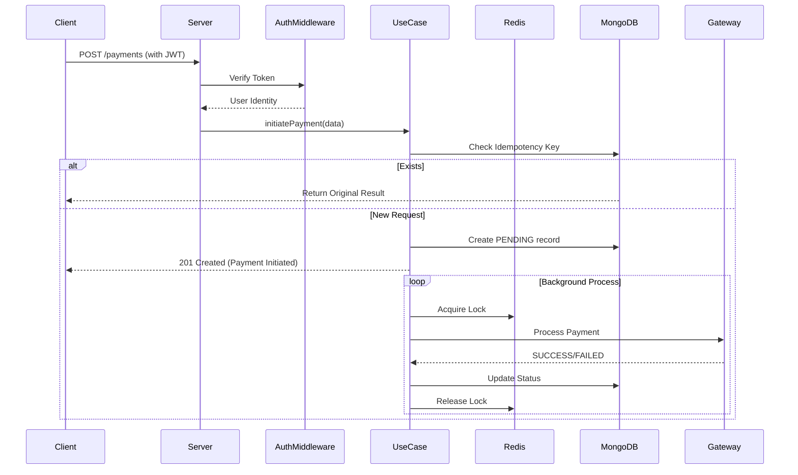

# 💳 Ultimate Payment Processing System — Master Technical Guide

A production-grade, enterprise-ready payment processing backend built with **Clean Architecture**. This system handles distributed concurrency, guarantees idempotency, and provides resilient failure recovery.

---

## 🌍 Real-World Business Scenarios
The patterns in this codebase solve critical financial problems encountered by platforms like **Stripe** or **PayPal**:

### 1. The "Double-Click" Problem (Idempotency)
- **Problem**: A customer clicks "Pay" twice due to a slow connection.
- **Fix**: We use an `idempotencyKey`. If the key exists in our DB, we return the cached response instead of charging the card again.

### 2. The "Slow Bank" Problem (Asynchronous Flow)
- **Problem**: Bank APIs can take up to 30 seconds.
- **Fix**: We return a `201 Initiated` response immediately and process the bank call in a background worker.

### 3. The "Race Condition" Problem (Redis Locking)
- **Problem**: Two separate systems try to update a payment status at the same millisecond.
- **Fix**: We use a **Distributed Mutex Lock** via Redis. Only one process can "hold the key" to a payment at a time.

---

## 🏗️ System Architecture & Data Flow



---

## 🛠️ Infrastructure Deep-Dive

### Server Factory (`src/infrastructure/webServer/server.ts`)
**Logic Breakdown:**
- **Lines 1-20**: Imports global security middlewares and route definitions.
- **Lines 25-30**: Initializes MongoDB Atlas and Redis connections simultaneously.
- **Lines 35-45**: Applies **Rate Limiting** globally using fingerprinting.
- **Lines 50-60**: Applies **JWT Auth** globally to secure all endpoints.

```typescript
import express, { Application, Request, Response, NextFunction } from 'express';
import http from 'http';
import paymentRoutes from '../routes/paymentRoutes';
import webhookRoutes from '../routes/webhookRoutes';
import authRoutes from '../routes/authRoutes';
import { RateLimitingMiddleware } from './middlewares/RateLimitingMiddleware';
import { isRateLimitExcluded, isAuthExcluded } from '../config/excludedPaths';
import handleErrors from './middlewares/ErrorHandler';
import { AuthMiddleware } from './middlewares/AuthMiddleware';
import logger from '../logging/AppLogger';
import { MongoConnection } from '../database/MongoConnection';
import redisClient from '../cache/RedisService';

export const createServer = async (): Promise<Application> => {
  const app: Application = express();

  // 1. Database Connections
  await MongoConnection.connect();
  logger.info('[REDIS] Initializing Redis connection...');

  // 2. Global Security (Rate Limiting)
  app.use((req: Request, res: Response, next: NextFunction) => {
    if (isRateLimitExcluded(req.path)) return next();
    return RateLimitingMiddleware.generalRateLimit(req, res, next);
  });

  // 3. Global Security (Auth)
  app.use((req: Request, res: Response, next: NextFunction) => {
    if (isAuthExcluded(req.path)) return next();
    return AuthMiddleware.verifyToken(req, res, next);
  });

  app.use(express.json());
  app.use('/payments', paymentRoutes);
  app.use('/webhooks', webhookRoutes);
  app.use('/auth', authRoutes);
  app.use(handleErrors);

  const PORT = process.env.PORT || 3000;
  app.listen(PORT, () => {
    logger.info(`[Server] ⚡️: Server is running on port http://localhost:${PORT}`);
  });

  return app;
};
```

---

## 🛡️ Security Implementation

### Rate Limiter (`src/infrastructure/webServer/middlewares/RateLimitingMiddleware.ts`)
**How Fingerprinting Works**: We combine IP, User-Agent, and the Request Body Hash. This stops bots even if they change their IP.

```typescript
import rateLimit, { ipKeyGenerator } from 'express-rate-limit';
import crypto from 'crypto';
import RedisStore from 'rate-limit-redis';
import redisClient from '../../cache/RedisService';

export class RateLimitingMiddleware {
  // Generates a unique signature for the specific request content
  private static generateRequestSignature(req: Request): string {
    const signatureString = `${req.method}:${req.path}:${JSON.stringify(req.body)}`;
    return crypto.createHash('sha256').update(signatureString).digest('hex');
  }

  // Final key: IP + UserAgent + ContentHash
  private static keyGenerator = (req: Request): string => {
    const ip = req.ip as string;
    const userAgent = req.headers['user-agent'] || 'unknown';
    const requestSignature = RateLimitingMiddleware.generateRequestSignature(req);
    return `${ip}:${userAgent}:${requestSignature}`;
  };

  static generalRateLimit = rateLimit({
    windowMs: 15 * 60 * 1000,
    limit: 100,
    skip: () => redisClient.status !== 'ready', // Prevents server hang if Redis is down
    store: new RedisStore({ sendCommand: (...args: string[]) => redisClient.call(...args) }),
    handler: (req, res) => {
      res.status(429).json({ status: 'error', message: 'Too many requests' });
    },
  });
}
```

---

## ⚙️ Business Logic (Use Cases)

### Payment Processing (`src/useCases/processPayment/ProcessPaymentUseCase.ts`)
**The State Machine**: Payments move through `PENDING` -> `PROCESSING` -> `SUCCESS/FAILED`.

```typescript
import { PaymentStatus } from '../../domain/PaymentEntity';
import { LockService } from '../../infrastructure/cache/RedisService';
import logger from '../../infrastructure/logging/AppLogger';

export default class ProcessPaymentUseCase {
  async initiatePayment(data: any) {
    // 1. Idempotency Check: Don't allow same key twice
    const existing = await this.PaymentRepository.findByIdempotencyKey(data.idempotencyKey);
    if (existing) return { payment: existing, isIdempotent: true };

    // 2. Create Record: Persist to Mongo as PENDING
    const payment = await this.PaymentRepository.create({
      ...data,
      status: PaymentStatus.PENDING,
      externalId: `ext_${Date.now()}`
    });

    // 3. Async Background Processing
    this.processPayment(payment._id).catch(err => logger.error(err));

    return { payment, isIdempotent: false };
  }

  async processPayment(paymentId: string) {
    // Distributed Lock: Ensure no other thread touches this payment
    const lock = await LockService.acquireLock(paymentId);
    if (!lock) return;

    try {
      await this.PaymentRepository.updateStatus(paymentId, PaymentStatus.PROCESSING);
      const res = await this.GatewaySimulator.process(100, 'USD');
      const finalStatus = res.success ? PaymentStatus.SUCCESS : PaymentStatus.FAILED;
      await this.PaymentRepository.updateStatus(paymentId, finalStatus);
    } finally {
      // Lock will expire automatically in Redis
    }
  }
}
```

---

## 📡 API Spec & Testing Guide

### 1. Get Access Token
`POST /auth/generate-token`
- **Body**: `{"email": "admin@example.com", "password": "admin123"}`
- **Note**: This returns the JWT required for all other calls.

### 2. Initiate Payment
`POST /payments`
- **Header**: `Authorization: Bearer <TOKEN>`
- **Body**:
  ```json
  {
    "amount": 100,
    "currency": "USD",
    "idempotencyKey": "unique_transaction_id"
  }
  ```

### 3. Webhook Callback
`POST /webhooks/gateway`
- **Body**: `{"externalId": "ext_123", "status": "SUCCESS"}`

---

## 🛠️ Configuration (Environment Variables)
| Variable | Description | Default |
| :--- | :--- | :--- |
| `PORT` | Port for the server to listen on | `3000` |
| `MONGO_URI` | MongoDB Connection String | `Required` |
| `REDIS_URL` | Redis Connection URL | `Required` |
| `JWT_SECRET` | Secret key for JWT signing | `Required` |
| `RATE_LIMIT_EXCLUDED_PATHS` | Comma-separated paths to ignore rate limit | `/health` |

---
*Manual Generated for: Rishikeshkt998/PAYMENT_PROCESSING_SYSTEM*
